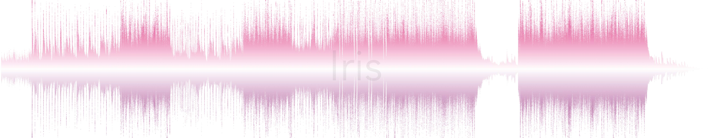
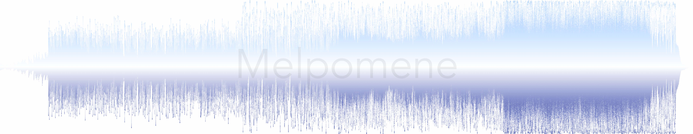

# WaveArt

The purpose of this repo is to create visually attractive waveform representations of songs. In the long term, I'd like to combine my [lastfm](https://www.last.fm/) "scrobbles" history with my iTunes library, so that it automatically generates the waveforms for the top-played songs (as rated by "play count"). For now, it takes the audio-files stored in the `./audio/` folder, and generates a visualization that is saved to the `./out/` path.

##  Instructions

For an "automatic" selection of parameters:

1. Place your `MP3` and `M4A` files in the `./audio/` folder.
2. Rename the files with the song title (for overlaying purposes).
3. Run the `waveart.py` file. This will load and process the files and randomly select colors from a pre-defined pool.

For finer control over the parameters, please have a look at the `waveart.py` script and modify as needed (will make improvements on the code in the near future).

##  Files' Description

* `waveart.py`: Main plotting routine.
* `fonts.py`: Lists all the fonts available to [matplotlib](https://matplotlib.org/) with an example.
* `style.py`: Fonts, colors, and plot-styles definitions.
* `aux.py`:

##  Dependencies

The code requires the following dependencies installed:

* [pydub](https://pypi.org/project/pydub/)
* [matplotlib](https://pypi.org/project/matplotlib/)

## Author

 

[Héctor M. Sánchez C.](https://chipdelmal.github.io/)
