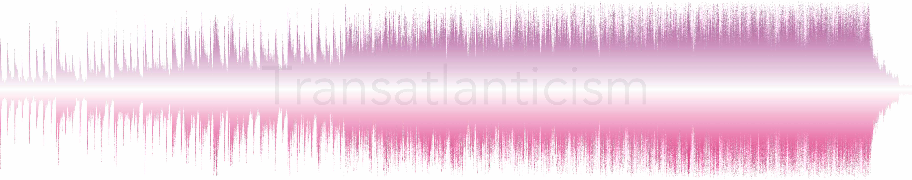

# WaveArt

The purpose of this repo is to create visually attractive waveform representations of songs. In the long term, I'd like to combine my [lastfm](https://www.last.fm/) "scrobbles" history with my iTunes library, so that it automatically generates the waveforms for the top-played songs (as rated by "play count"). For now, it takes the audio-files stored in the `./audio/` folder, and generates a visualization that is saved to the `./out/` path.

##  Dependencies

The code requires the following dependencies installed:

* [pydub](https://pypi.org/project/pydub/)
* [matplotlib](https://pypi.org/project/matplotlib/)

## Author

 

[Héctor M. Sánchez C.](https://chipdelmal.github.io/)
